## Overview

In this project, I have build a Github repository from scratch and created a scaffolding that assisted in performing both Continuous Integration and Continuous Delivery. I have used Github Actions along with a Makefile, requirements.txt and application code to perform an initial lint, test, and install cycle and integrated this project with Azure Pipelines to enable Continuous Delivery to Azure App Service.

> CI/CD setup of flask webapp

## Project Plan

* Trello Board:- [trello project link](https://trello.com/b/qaEEVTHN/project6-ci-cd-pipline)
* Spreadsheet project plan:- [google docs link](https://docs.google.com/spreadsheets/d/1Oz06AUiOaEsVhuFKvpd0HpCWOk3DEBKLGHoT9eCG44A/edit?usp=sharing)

## Instructions

Top Level architecurte diagram.


These diagram shows the sequence and component required to build the ci/cd pipeline in flask webapp using azure app service.

Lets go to each components one by one.

### 1. Prerequisite
This project required the python 3.7 make sure you are using this version locally as well as in azure cloud shell.  
Steps to install python 3.7 in linux machine.  

```
$wget https://repo.anaconda.com/miniconda/Miniconda3-py37_4.10.3-Linux-x86_64.sh
```
```
$sh Miniconda3-py37_4.10.3-Linux-x86_64.sh
```
```
$export PATH=~/miniconda3/bin:$PATH
```
```
$python -V
```

### 2. Continuous Integration
Continouse Integration setup is divided into two parts, one is setting up azure cloud shell enviroment to run it locally on azure shell using makefile to test install and setup, seconds step is configure github actions to perform CI remotely.

#### CI: Set Up Azure Cloud Shell
In this diagram, the Azure Cloud Shell is used to create an empty scaffold of tests, source code, Makefile, and requirements.


our code already contains the Makefile, requirement.txt, so we will go ahead and setup [github repo](https://docs.github.com/en/get-started/quickstart/create-a-repo) and create a azure cloud shell.  

**1. Cloud-Based Development Environment**. 

We will [ssh key pair](https://docs.github.com/en/authentication/connecting-to-github-with-ssh/generating-a-new-ssh-key-and-adding-it-to-the-ssh-agent) for cloing the github repo into azure cloud shell(linux terminal).

````
$git clone git@github.com:ajaysinghthakur/azure-ci-cd.git
````
	
Screenshot showing project cloned in azure cloud shell
	
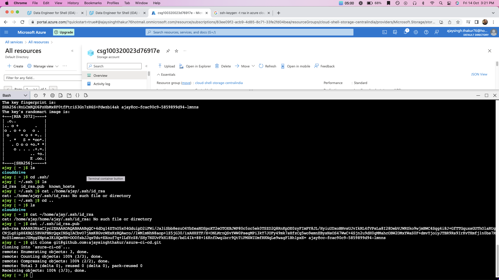

**2. Local Test**.  
Run make all which will install, lint, and test code. This enables us to ensure we don't check in broken code to GitHub as it installs, lints, and tests the code in one command. 

```
$cd azure-ci-cd/
```
```
$python -m venv ~/.myrepo
```
```
$source ~/.myrepo/bin/activate
```
```
make all
```

Screenshot showing the passing test that are displayed after running `make all` commnad.
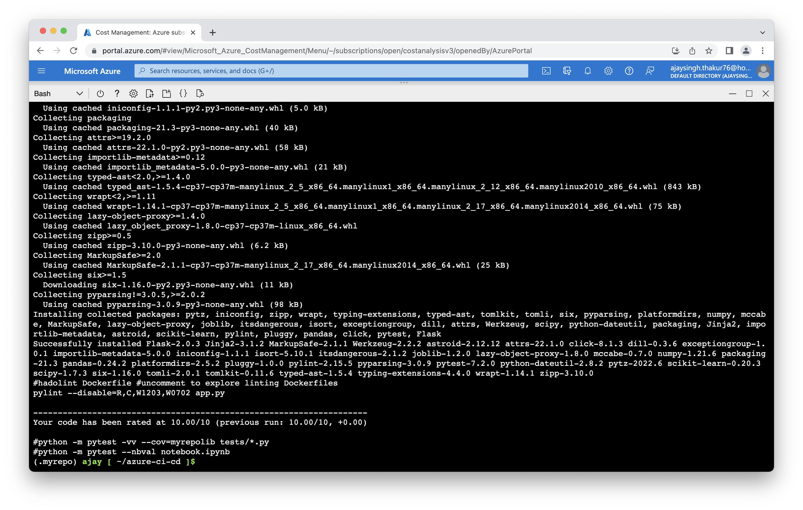

After sucessfully passing all test and linting, let run the app locally in azure cloud shell and run the local predection.  

Run the application.  

```
$python app.py
```
Screenshot showing application running
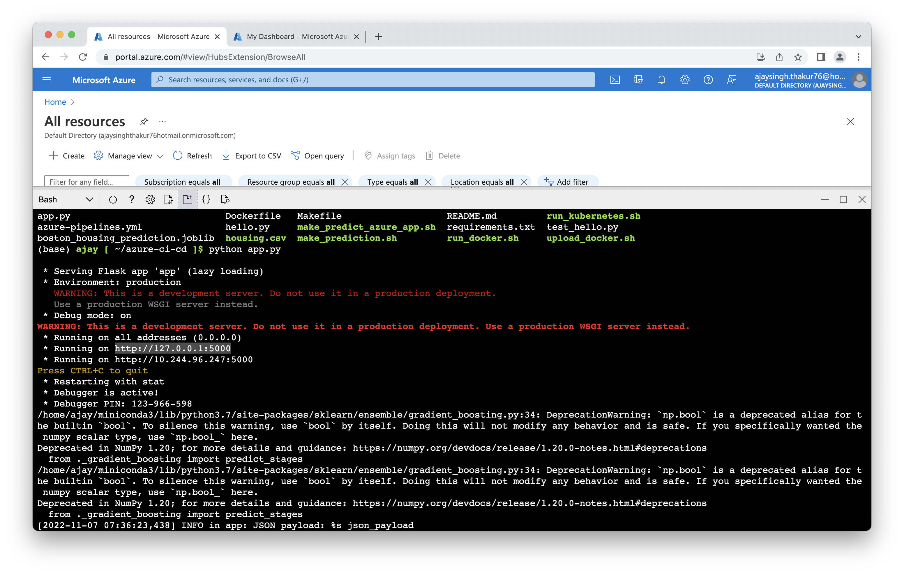

And run the local predction using commnad

```
$./make_prediction.sh
```

Screenshot showing local prediction.  
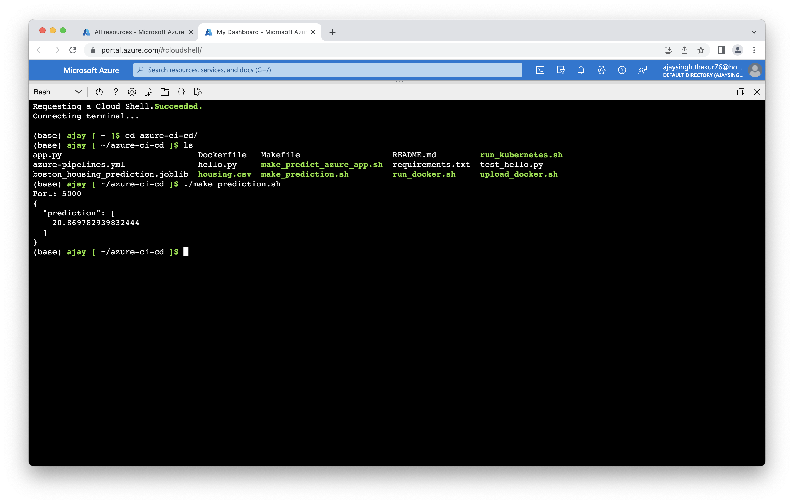

#### CI: Configure GitHub Actions

Configure GitHub Actions to test the project upon change events in GitHub. This is a necessary step to perform Continuous Integration remotely.

Configuring a SaaS build server like GitHub Actions is an essential step for any software project that wants to apply DevOps best practices. This completes the final section of Continous Integration and enables us to then move on to the later step of Continuous Delivery once this is complete.

This diagram shows how code can be tested automatically by enabling GitHub Actions. The push change to GitHub triggers the GitHub Actions container, which in turn runs a series of commands.


Github action is enable by ui, check the yml file at path .github/main.yml, see the configuration.

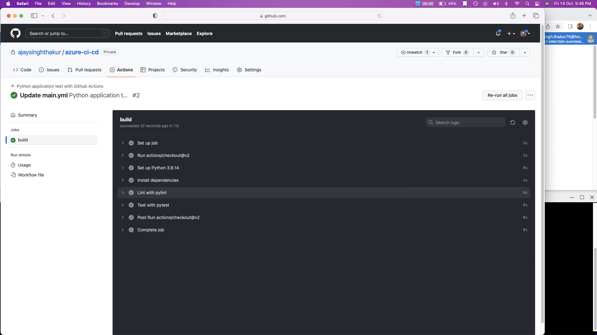

### 3. Continuous Delivery

This diagram shows the continuous delivery of a flask application through the use of Azure Pipelines and Azure App service.


**1. Deploy the app to an Azure App Service**.  
To enable to continous devliery we need to first deploy our app to azure app service.  

In this example the App Service is called `ajay-flask-webapp` and the resource group is called `project6`. In the first Cloud Console run the follow command, the result take a few minutes:

```
az webapp up --name ajay-flask-webapp --resource-group project6 --runtime "PYTHON:3.7"
```

Screenshot of azure cloud shell running the command and creating
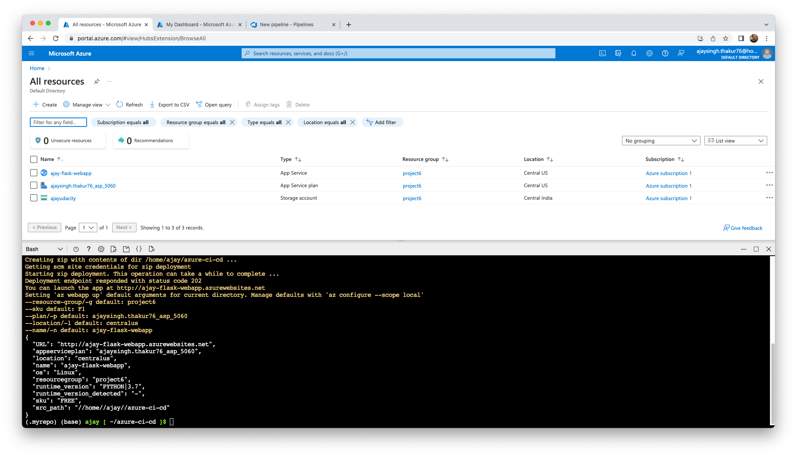

Screenshot of azure app service running in azure portal
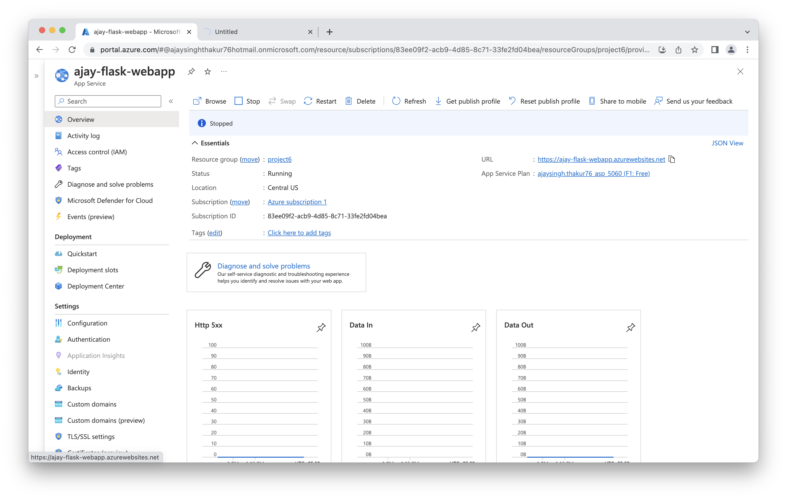

Screenshot of webapp running in its url
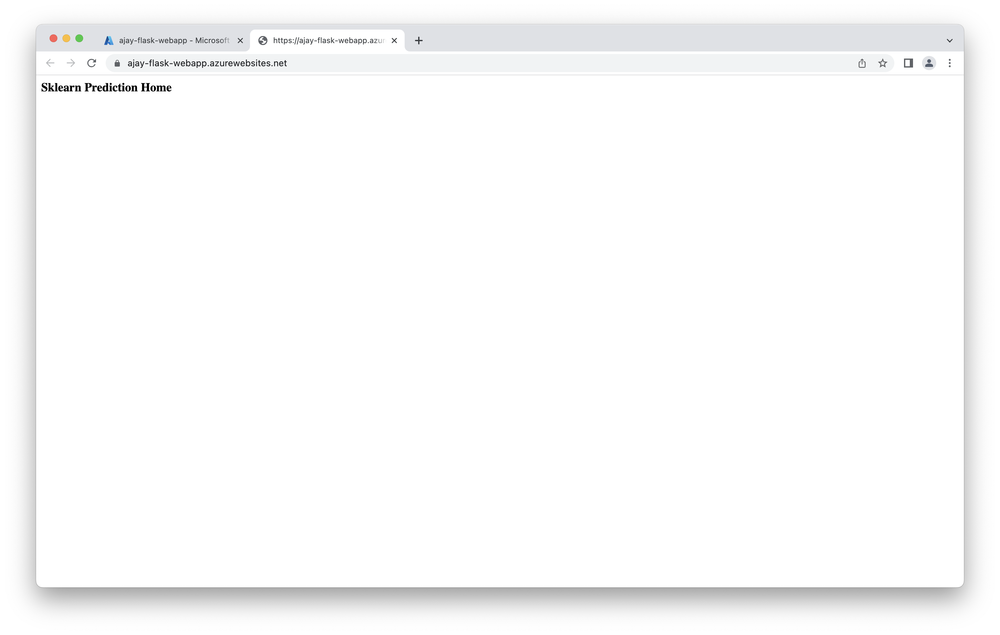

After creating the webapp in azure app service now we can run the prediction.

```
$./make_predict_azure_app.sh
```
Screenshot of prediction on azure app
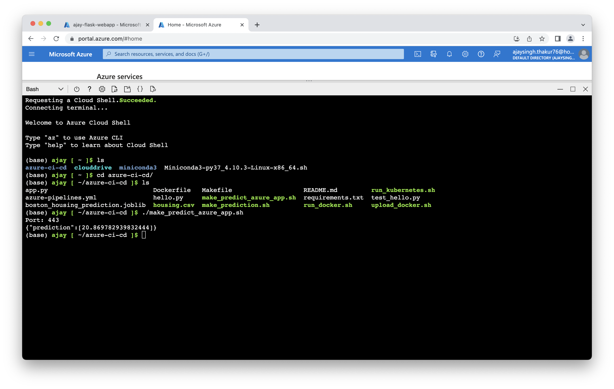

**2. Azure Devops and Azure pipeline**.  

Once the flask webapp is deployed in azure app service now we can configure the azure devops and azure pipeline for continous devlivery trigered on git changes.  

1. Sign in of [https://dev.azure.com/](https://dev.azure.com/) and create a private project.  
2. Connect the devops project to azure, through *service connection* and *azure resource manager*.  
3. Create a new pipeline (python to linux web app on azure)linked to your GitHub repo. 

Your can read in detail about the steps in [this article](https://learn.microsoft.com/en-us/azure/devops/pipelines/ecosystems/python-webapp?view=azure-devops&WT.mc_id=udacity_learn-wwl)

Screenshot of pipeline stages flow
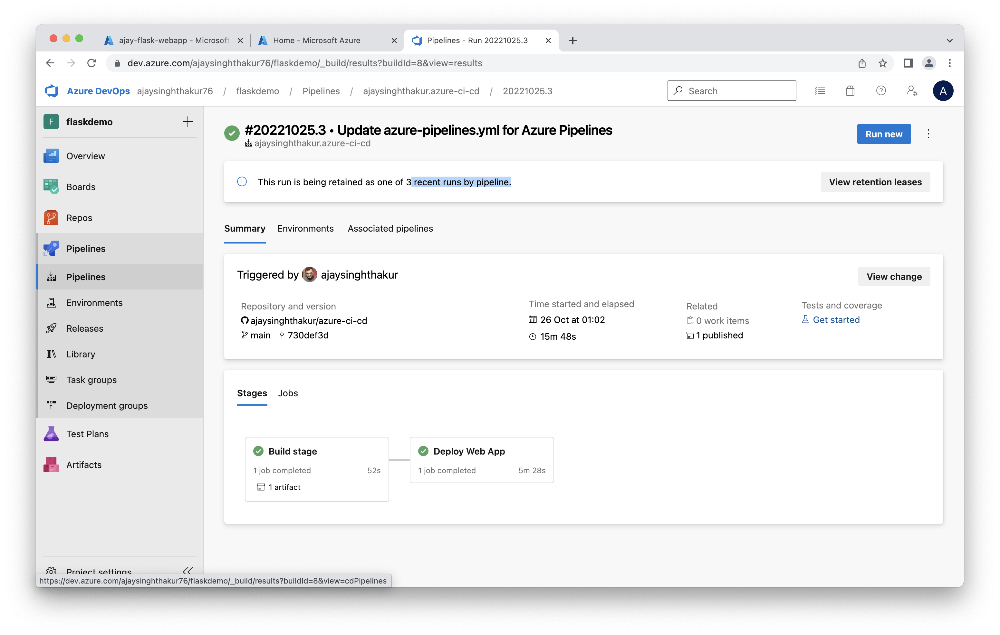

Screenshot of a successful run of the project in Azure Pipelines
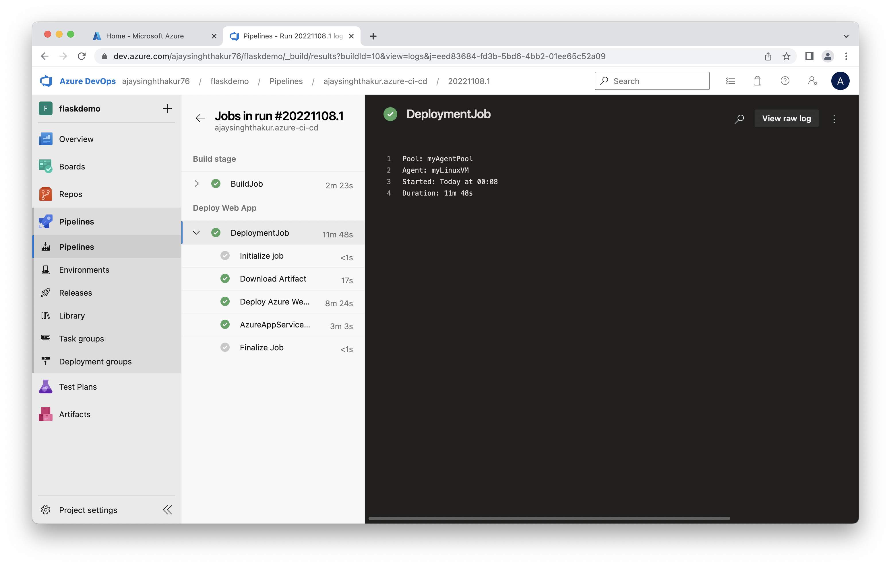
**3. Logs**.  

logs of the running application.  

```
$az webapp log tail -n ajay-flask-webapp -g project6
```

Screenshot of logs
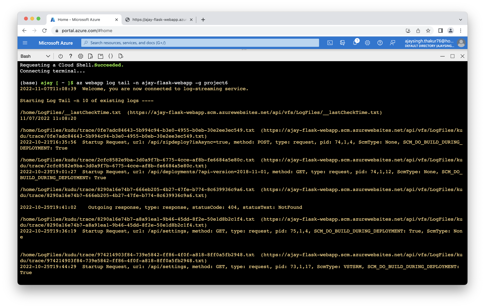

**3. Load Testing**.

Modify the Makefile and add `pip install locust` and `pip install locust-plugins` inside install tag, the run the commnad.  

Run locally
```
locust -f locustfile.py
```

Screenshot to show the result of load testing

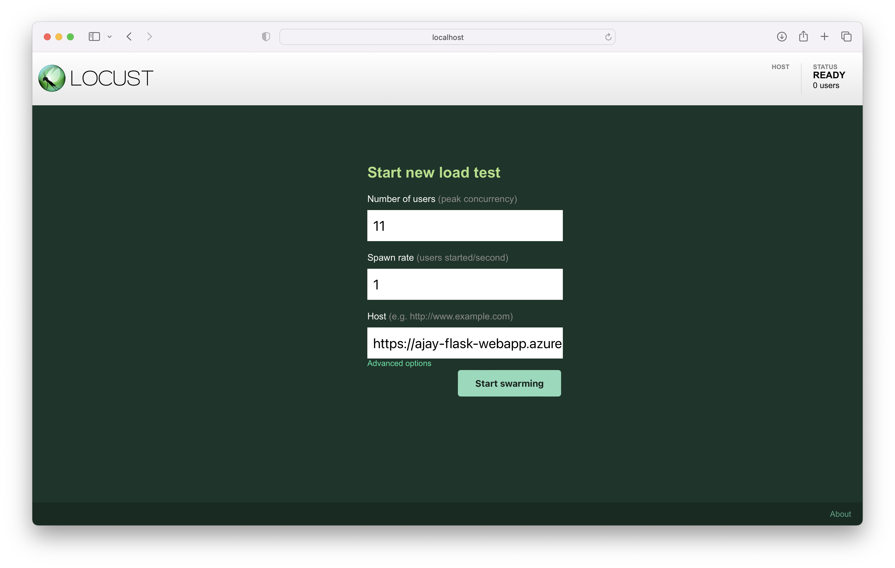
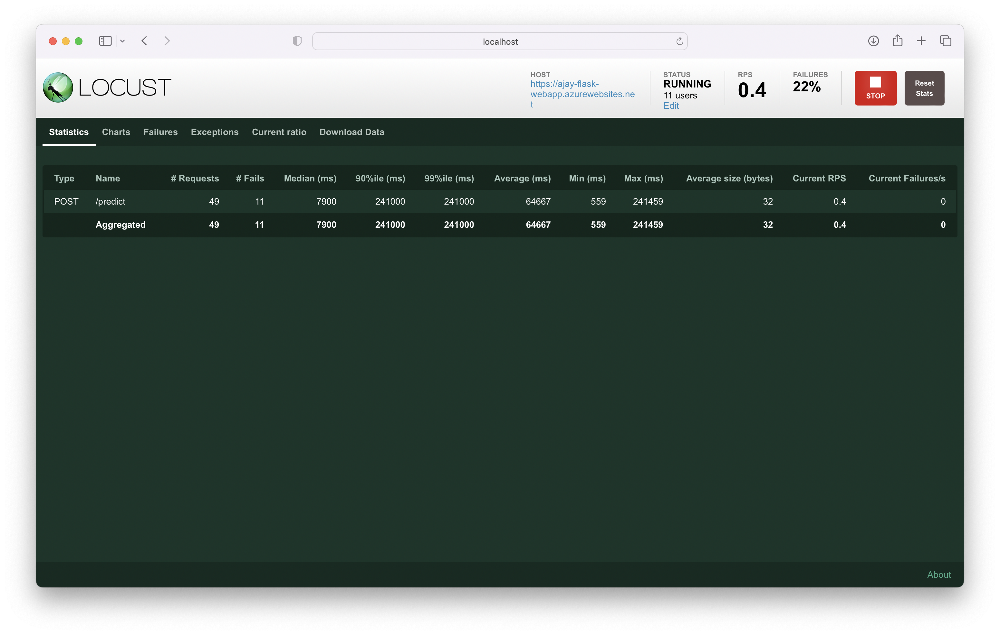


## Enhancements
1. Adding better test cases in continouse integration flow.
2. Can use github action for continouse distrubtion.
3. Interactive Web UI, for interacting with flask webapp and inputing predictions.
4. can use gitflow(git branches and command), to setup different enviroment like, staging, production, development etc.

## Demo 

Demo in youtube [link](https://youtu.be/gOATxWh1Iyk)


